# Variational Autoencoder (VAE) with PyTorch — CelebA

This repository implements a **Variational Autoencoder (VAE)** using **PyTorch**, inspired by the referenced [Kaggle project](https://www.kaggle.com/code/asheniranga/variational-autoencoder-with-pytorch), with the goal of learning a smooth latent representation of images and generating new, realistic samples. Unlike quantized or deterministic autoencoders, the VAE framework enforces a probabilistic latent space, enabling continuous interpolation and more coherent sample generation.

The model is trained on the **CelebA dataset**, a large-scale face attributes dataset commonly used for generative modeling research. By leveraging an encoder–decoder architecture with a variational bottleneck, this project focuses on understanding latent space regularization, reconstruction quality, and sample diversity in image generation tasks.

This repository documents the implementation step by step, with explanations accompanying each code block.

We trained the model for **300 epochs** on the full dataset.  
The corresponding learning curves are shown below:

  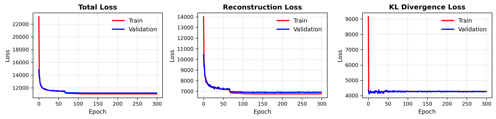

A subset of the original input images is shown below:

  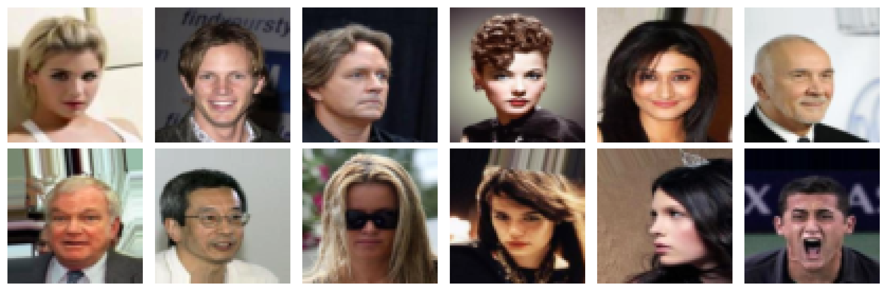

Generated sample images produced by the **encoder–decoder model** are shown below:

  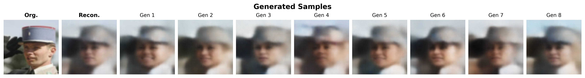
  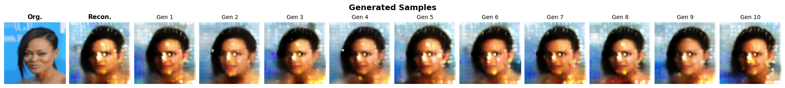

The video demonstrates how the model progressively improves image reconstruction on a validation sample.

  

---
© Ashkan M., NTNU  
Released under the MIT License
---

# Vector Quantized Variational Autoencoder (VQ-VAE)

This repository provides a concise and practical implementation of the **Vector Quantized Variational Autoencoder (VQ-VAE)**, originally introduced by [A. Oord et. al.](https://arxiv.org/pdf/1711.00937.pdf) (2017). Unlike standard VAEs, VQ-VAE replaces the continuous latent space with a **discrete, learnable codebook**, enabling more structured latent representations and sharper reconstructions.

The model is trained on the **CelebA dataset**, a widely used benchmark for generative modeling with face images. Through an encoder–decoder architecture combined with vector quantization, this project explores discrete latent representations, reconstruction fidelity, and sample generation behavior, serving as an accessible tutorial for understanding VQ-VAE fundamentals in practice.

Subsequent document provides an step by step implementation guide.

We trained the model for **500 epochs** on the full dataset.  
The corresponding learning curves are shown below:

  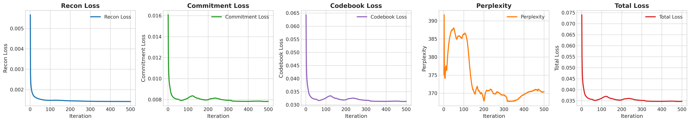

A subset of the original input images is shown below:

  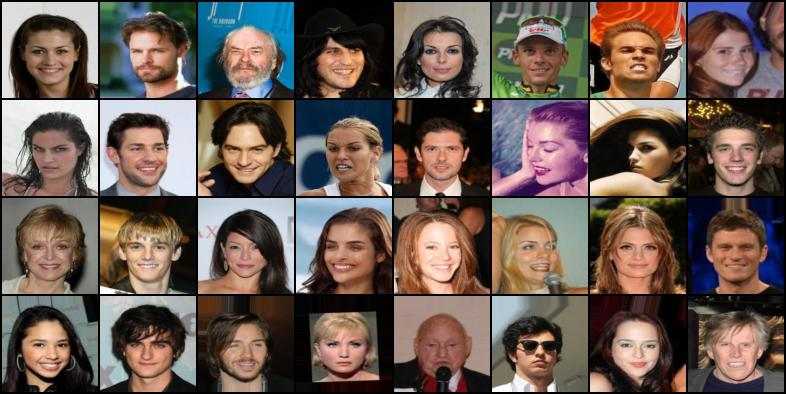

The corresponding reconstructed images produced by the **encoder–decoder model** are shown below:

  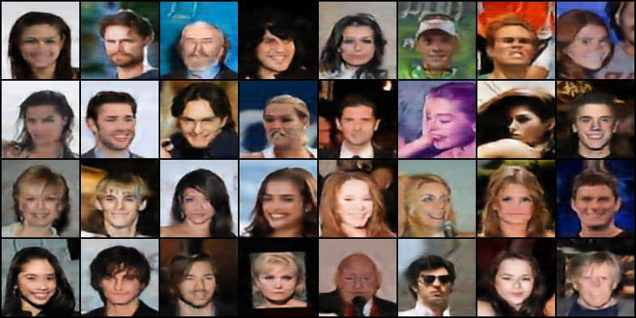

# Generating Samples from the VQ-VAE Codebook

Generates and visualizes images from the trained VQ-VAE under different latent manipulation modes. Given real input images, the encoder maps them to discrete codebook indices, which are then modified depending on the selected mode before decoding. The resulting outputs for different modes are plotted alongside the original inputs, enabling qualitative comparison of reconstruction quality and generative behavior under each manipulation strategy.

**Reconstruct**: Uses the original encoded indices to reconstruct the input images.

  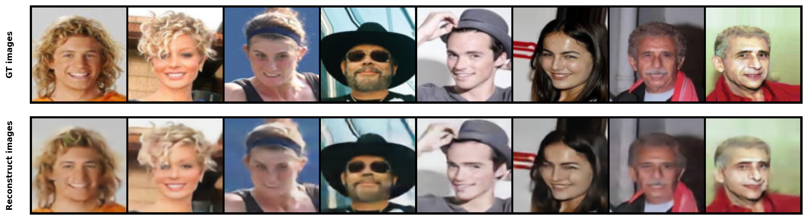

**Random**: Replaces latent indices with random codebook entries to generate novel samples.

  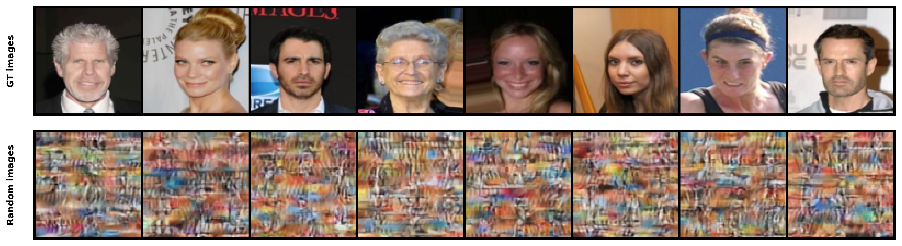

**Perturb**: Randomly alters a fraction of latent indices to introduce controlled variation.

  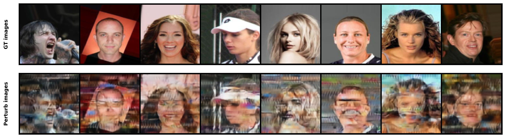

**Interpolate**: Blends latent codes between pairs of samples to observe smooth transitions.

  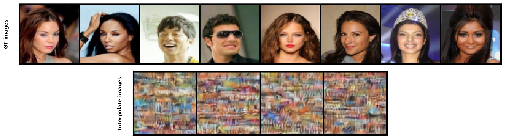

© Ashkan M., NTNU  
Released under the MIT License
